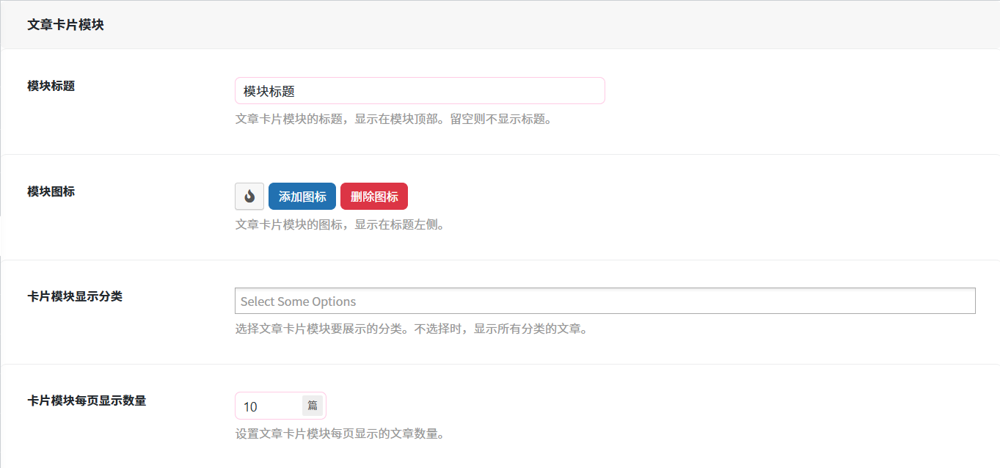
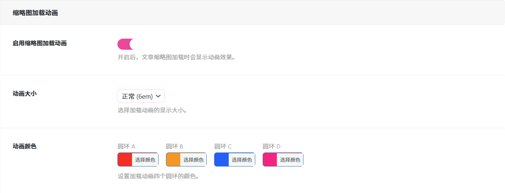
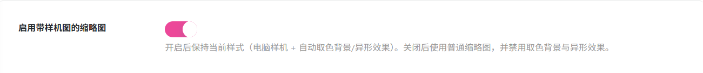
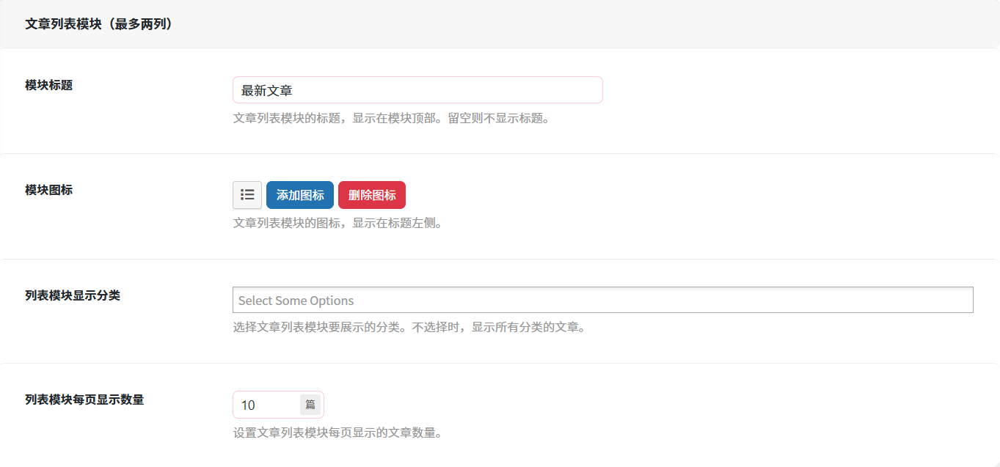

# 文章设置
作者：[阿城](https://blog.morehouse-s.com/)

## 文章卡片模块

### 模块标题
文章卡片模块的标题，显示在模块顶部。留空则不显示标题。

### 模块图标
文章卡片模块的图标，显示在标题左侧。

### 卡片模块显示分类
选择文章卡片模块要展示的分类。不选择时，显示所有分类的文章。

### 卡片模块每页显示数量
设置文章卡片模块每页显示的文章数量。

## 缩略图加载动画

### 启用缩略图加载动画
开启后，文章缩略图加载时会显示动画效果。

### 动画大小
设置视觉呈现尺度。
通过下拉菜单可调整加载动画的尺寸规格，不同大小适配不同的界面布局。

### 动画颜色
自定义视觉风格。
可分别设置加载动画中圆环 A、圆环 B、圆环 C、圆环 D 的色彩。

## 缩略图样机
### 启用带样机图的缩略图

开启后保持当前样式（电脑样机 + 自动取色背景/异形效果）。关闭后使用普通缩略图，并禁用取色背景与异形效果。

## 文章列表模块（最多两列）

### 模块标题
设置模块名称。
此处可修改显示在模块顶部的文字标题（当前默认是 “最新文章”）。
输入标题后，前端页面该板块的上方会显示该标题；
如果留空，则该区域只显示内容，不显示任何标题文字。

### 模块图标
装饰性视觉元素。
通过 “添加图标” 和 “删除图标” 按钮，可以为标题左侧增加一个图标素材。

### 列表模块显示分类
核心作用：内容筛选。
通过下拉菜单可指定文章分类。
选择后只会展示你选中分类下的文章.
不选择时默认显示所有分类下的所有文章。

### 列表模块每页显示数量
控制分页密度。
用于设定单一页面中展示多少篇文章（当前默认设置为 10 篇）。
设定数量后，页面加载时会一次性呈现对应篇数的文章标题 / 摘要；
当文章总数超过设定数量时，页面会自动生成 “下一页” 等分页功能。

