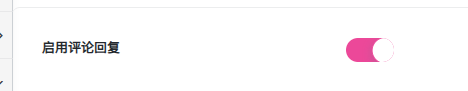

# 评论设置
作者：[阿城](https://www.hidesg.ink/)
## 基础功能

### 启用评论点赞

这是评论点赞模块的总开关。 开启后，用户就可以对文章或内容下的评论进行点赞操作。  关闭后，整个评论点赞功能都会被隐藏或禁用，用户无法对任何评论进行点赞。

### 启用评论回复

这是评论点赞模块的总开关。 开启后，用户可针对他人的单条评论进行直接回复，形成 “主评论 - 子回复” 的层级化互动；关闭后，评论区仅能发布独立的主评论，无法对单条评论进行针对性回复。

### 启用表情包

这是表情包模块的总开关。 开启后，用户在发表评论或互动时，就可以从系统提供的表情包中选择表情发送，让交流更生动、更有情绪表达力；关闭后，表情包功能会被禁用，用户只能使用纯文字进行交流。

### 默认排序方式

设置评论区（或列表）在页面加载时，评论默认的展示顺序。

## 权限控制（后台可控）

### 谁可以查看评论

可以设置哪些人能查看评论

### 谁可以发表评论

可以设置哪些人能发表评论

## 审核设置

### 启用评论审核

开启后，新评论将进入“待审核”状态（管理员可在后台/前台审核通过或拒绝）。

### 哪些评论需要审核

可以设置哪些人发表评论后需要审核。

## 神评（自动 + 手动）

### 启用神评功能

筛选并优先展示高质量、高热度的用户评论。

### 自动神评：点赞阈值

用于定义评论被系统自动标记为 “神评” 的点赞门槛。
比如阈值为 30 赞，即当一条用户评论的点赞数达到 30 时，系统会自动将其标记为 “神评”。

### 自动神评：回复数阈值

用于定义评论被系统自动标记为 “神评” 的回复门槛。
比如阈值为 10 条，即当一条用户评论的回复数达到 10 时，系统会自动将其标记为 “神评”。

### 仅顶层评论参与自动神评

用于控制参与自动神评判定的评论范围。
开启后，系统仅对顶层评论进行自动神评判定；关闭后，系统会对所有评论进行判定。

## 邮件通知（配合 SMTP 设置使用）

### 启用评论相关邮件通知

用于控制你是否接收与评论相关的邮件提醒。
开启后，当你的内容收到新评论、你的评论被他人回复或点赞，或有其他与评论相关的动态时，系统会通过邮件向你发送通知；关闭后，将不再收到此类邮件提醒。

### @ 提及通知（有人在评论中 @ 我时发邮件）

用于控制你在被他人 @时是否收到邮件提醒。
开启后，当有人在评论中 @你的账号时，系统会立即向你发送邮件通知；关闭后，将不再收到此类邮件提醒。

### 审核结果通知评论者（通过/拒绝）

用于控制是否将评论的审核结果反馈给发表评论的用户。
开启后，当用户发表的评论经过审核（无论通过还是被拒绝），系统会将审核结果通知到评论者；关闭后，评论者将不会收到此类通知。

### 回复通知（有人回复我时发邮件）

用于控制你在收到他人回复时是否收到邮件提醒。
开启后，当有人回复你的评论时，系统会立即向你发送邮件通知；关闭后，将不再收到此类邮件提醒。

### 神评上榜通知（自动/手动成为神评时）

用于控制当你的评论被标记为 “神评” 时是否收到通知。
开启后，当你的评论通过自动判定或手动审核成为 “神评” 时，系统会向你发送通知；关闭后，将不会收到此类通知。

## 管理员通知（新评论）

### 通知管理员（有新评论时发邮件）

用于控制当有新评论产生时，是否向管理员发送邮件提醒。
开启后，每当平台上产生新的用户评论，系统会立即向管理员发送邮件通知；关闭后，管理员将不会收到此类邮件提醒。

### 管理员收件邮箱（可多个）

用于指定接收评论相关通知邮件的管理员邮箱地址。
你可以在文本框中填写一个或多个邮箱地址，每行填写一个。当 “通知管理员（有新评论时发邮件）” 功能开启后，系统会将新评论通知发送到这些邮箱。

### 待审核也通知管理员

用于控制当有评论进入待审核队列时，是否向管理员发送通知。
开启后，系统会立即向管理员发送通知，提醒有新的待审核内容；关闭后，管理员将不会收到此类通知。

### 已通过也通知管理员

用于控制当评论通过审核后，是否向管理员发送通知。
开启后，当用户发表的评论通过了系统或人工审核，系统会向管理员发送通知，告知该评论已成功发布；关闭后，管理员将不会收到此类通知。

## 字数限制

### 最少字数

用于限制用户发表评论的最短长度。
比如当前设置最少字数为 5 个字符，即用户发表的评论内容必须至少包含 5 个字符（汉字、字母、数字等），否则无法提交。

### 最多字数

用于限制用户发表评论的最大长度。
比如当前设置最多字数为 2000 个字符，即用户发表的评论内容不能超过 2000 个字符（汉字、字母、数字等），否则无法提交。

## 频率限制（防刷评论）

### 时间窗口

用于定义评论频率限制的统计周期。
比如当前时间窗口为 60 秒，即系统会以 60 秒为一个周期，统计用户在这段时间内发表评论的次数。

### 最大评论数

用于控制用户在指定时间窗口内可发表的评论数量。
比如当前最大评论数为 3 条，结合之前的 “时间窗口 60 秒” 设置，意味着用户在 60 秒内最多只能发表 3 条评论，超出限制后将被系统拦截。
