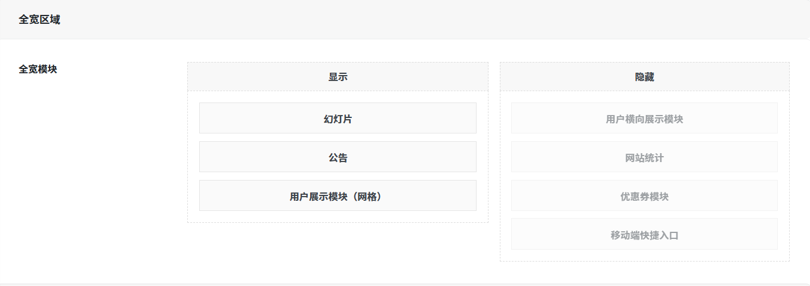
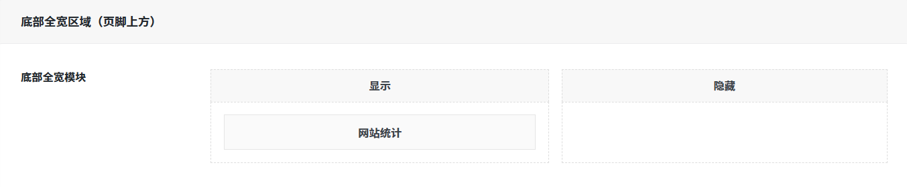
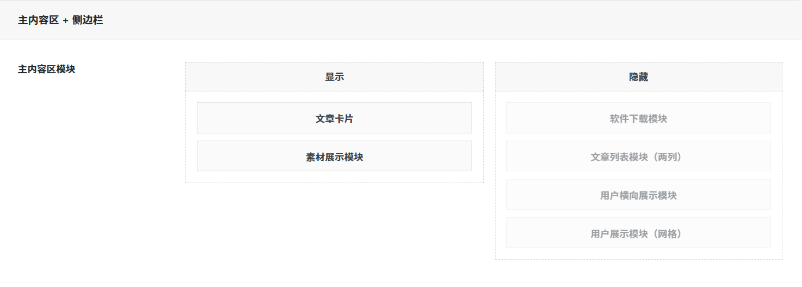
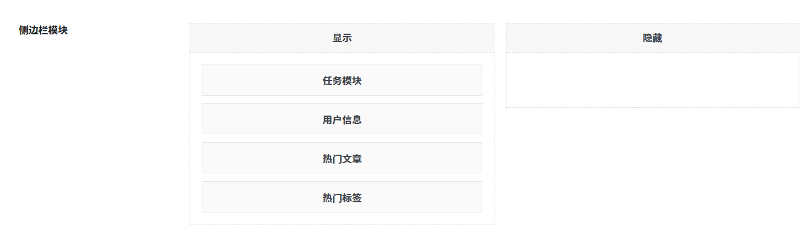

# 页面布局
作者：[阿城](https://blog.morehouse-s.com/)

## 全宽区域
### 全宽模块
横跨整个页面宽度（内容区上方），可自由拖动模块选择显示或隐藏内容。（你觉得怎么顺眼就怎么来）

## 底部全宽区域（页脚上方）
### 底部全宽模块
显示在页脚上方，可自由拖动模块选择显示或隐藏内容。（你觉得怎么顺眼就怎么来）

## 主内容区 + 侧边栏
### 主内容区模块
左侧主要内容，可自由拖动模块选择显示或隐藏内容。（你觉得怎么顺眼就怎么来）

## 侧边栏模块
右侧边栏区域，可自由拖动模块选择显示或隐藏内容。（你觉得怎么顺眼就怎么来）

## 侧边栏位置
可随时调整侧边栏到左侧位置显示或右侧位置显示。（你觉得怎么顺眼就怎么来）

