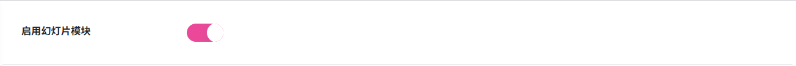
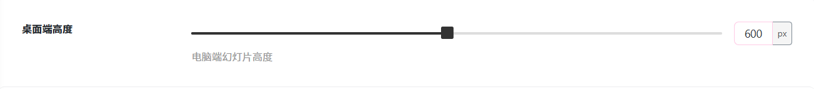
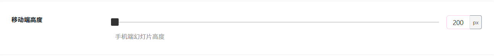
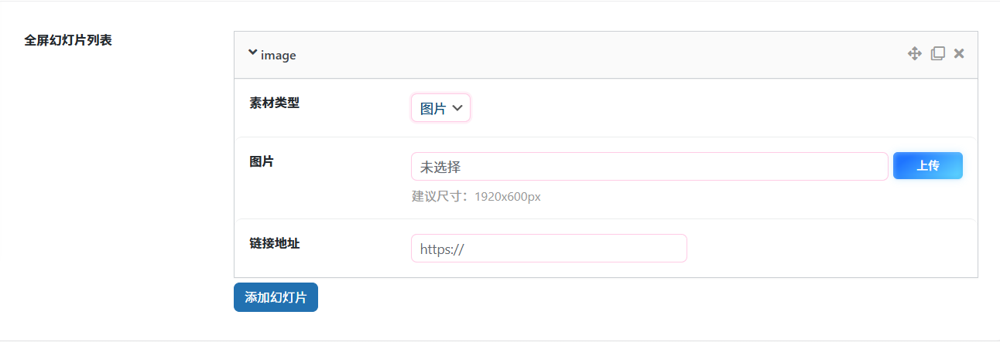
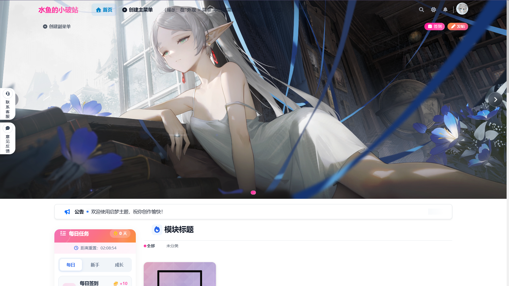
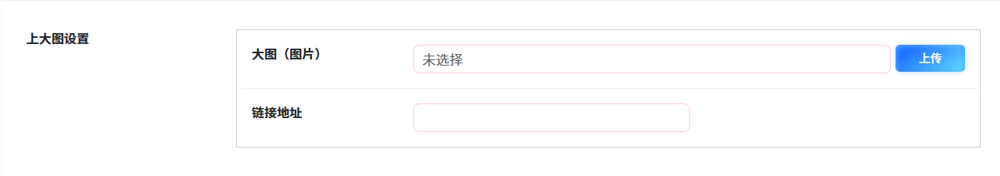
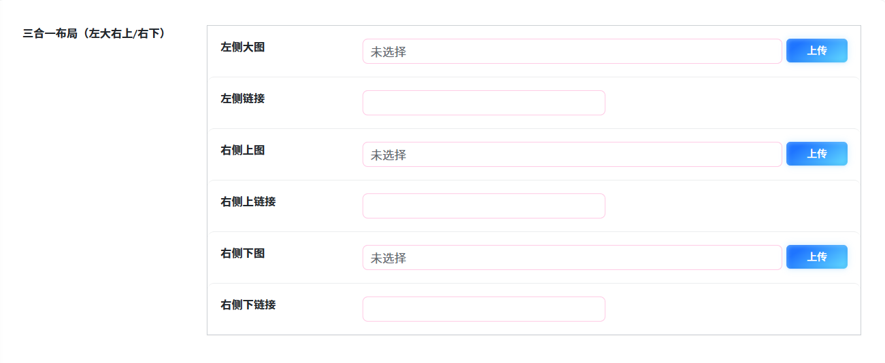
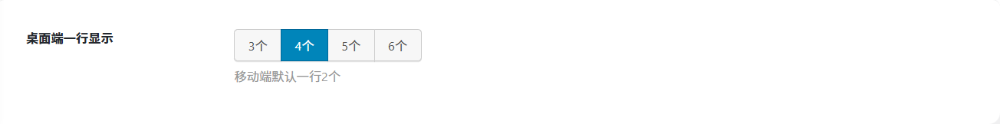
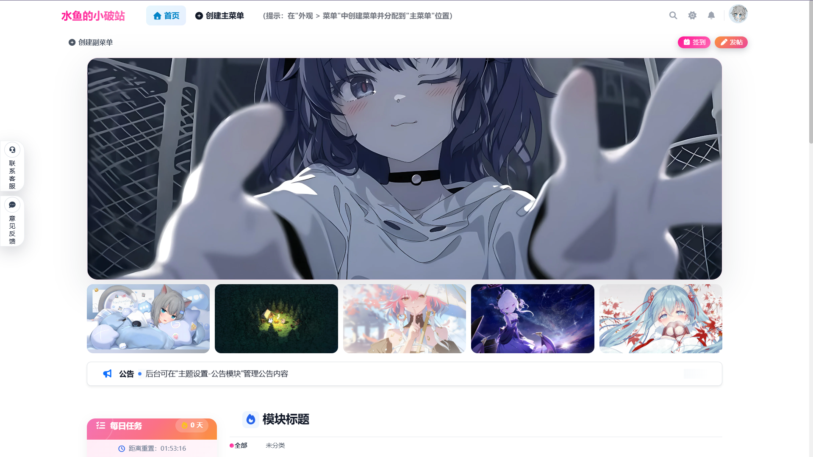

# 幻灯片设置
作者：[阿城](https://blog.morehouse-s.com/)

## 启用幻灯片模块

启用后将在前台显示幻灯片。

幻灯片一共有三种布局类型：**普通布局 三合一布局 上大图下卡片** 接下来将各个布局配置样式总结如下。

### 全屏布局

桌面端高度指的是幻灯片在电脑网页端展示的高度，默认高度为600px。可以根据自己喜好自由调整。

移动端高度指的是幻灯片在手机网页端展示的高度，默认高度为200px。可以根据自己喜好自由调整。

素材类型：可以选择 图片 / 视频
图片：选择你喜欢的图片上传即可。
链接地址：输入你想跳转的链接。没有请留空。

**全屏效果**

### 三合一布局

左侧大图：选择你喜欢的图片上传即可。
左侧链接：输入你想跳转的链接。没有请留空。

右侧上图：选择你喜欢的图片上传即可。
右侧上链接：输入你想跳转的链接。没有请留空。

右侧下图：选择你喜欢的图片上传即可。
右侧下链接：输入你想跳转的链接。没有请留空。

**三合一效果**

### 上大图下卡片

大图（图片）：选择你喜欢的图片上传即可。
链接地址：输入你想跳转的链接。没有请留空。

卡片图片：选择你喜欢的图片上传即可。
链接地址：输入你想跳转的链接。没有请留空。

桌面端一行显示默认4个，可以根据自己喜好自由调整。

**普通卡片效果**

