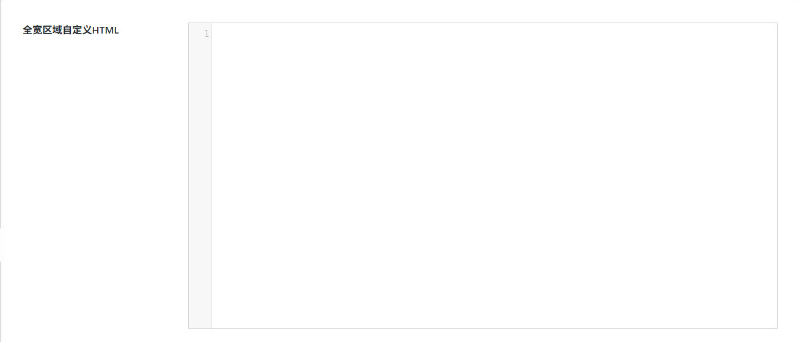
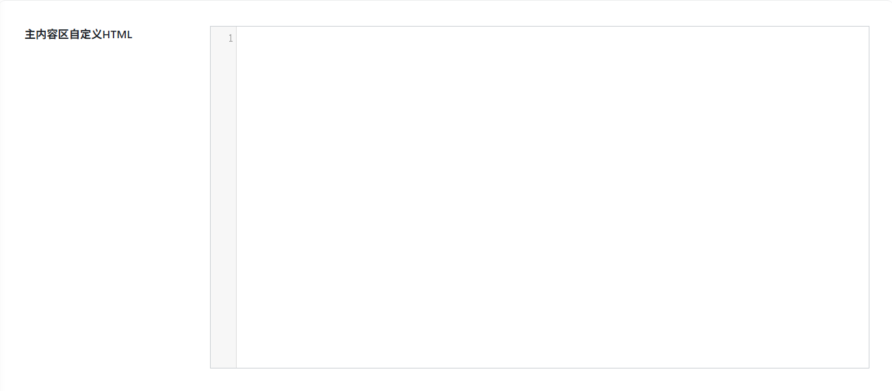
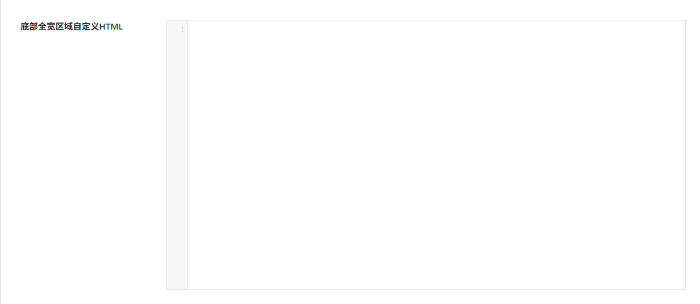

# 自定义HTML小工具
作者：[阿城](https://blog.morehouse-s.com/)

## 全宽区域自定义HTML

它是一个全宽（通栏）的代码编辑容器，你可以在其中直接编写或粘贴 HTML 代码，让这部分内容以 “全宽” 的形式展示在网站上。

## 主内容区自定义HTML

是建站系统中受页面版式约束的代码编辑模块，核心作用是在网站的 “主内容固定宽度区域” 内，通过自定义 HTML（可搭配 CSS、JS）实现定制化内容展示。

## 侧边栏自定义HTML

“侧边栏自定义 HTML” 是建站系统中针对侧边栏区域的代码编辑模块，允许你在网站的侧边栏中，通过自定义 HTML 实现高度定制化的内容展示。

## 底部全宽区域自定义HTML

“底部全宽区域自定义 HTML” 是建站系统中位于页面最底部的全宽代码编辑模块，它允许你在网站页脚位置，通过自定义 HTML 实现横跨整个屏幕的定制化内容。
