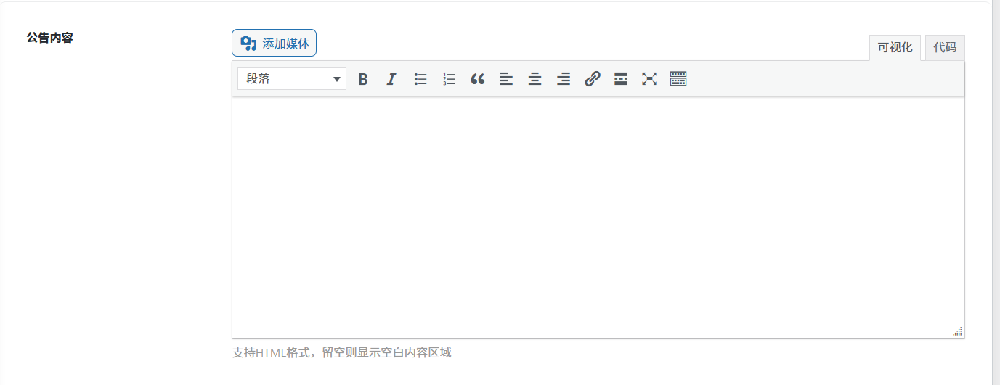

# 首页弹窗：会员入会
作者：[阿城](https://www.hidesg.ink/)

## 启用弹窗公告

启用后，网站首次访问或满足条件时会显示会员入会推广弹窗。

## 公告标题

填写你要发布的公告的核心标题。

## 公告内容

编写和编辑公告具体内容的核心区域。（支持HTML格式，留空则显示空白内容区域）

## 按钮文字

可自定义你想显示的在前台的文字。

## 按钮链接

设置用户点击公告里那个按钮后跳转的目标地址。

## 显示模式

控制公告在前端页面的展示频率和触发规则

## 延迟显示时间

页面加载后延迟多少秒显示弹窗（单位：秒）

