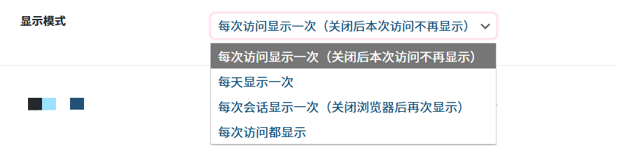

# 首页弹窗：普通公告
作者：[阿城](https://www.hidesg.ink/)

## 启用弹窗公告

启用后，网站首次访问或满足条件时会显示信封弹窗公告

## 公告标题

你想到什么好就写什么

## 公告副标题

你想到什么好就写什么

## 公告内容

你想写什么就写什么

## 底部签名

你想写什么就写什么

## 印章文字

信封上的印章显示的文字。

## 显示模式

根据自己需求选择。

## 延迟显示时间

页面加载后延迟多少秒显示弹窗（单位：秒）