# 安装WordPress
作者：[阿城](https://www.hidesg.ink/)

### 上传源文件
在网站页面里，点击网站根目录。
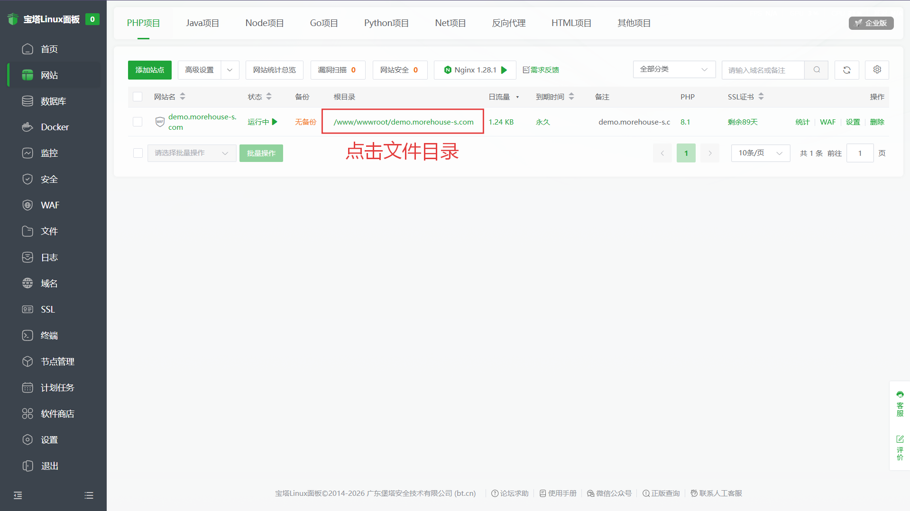
删除文件
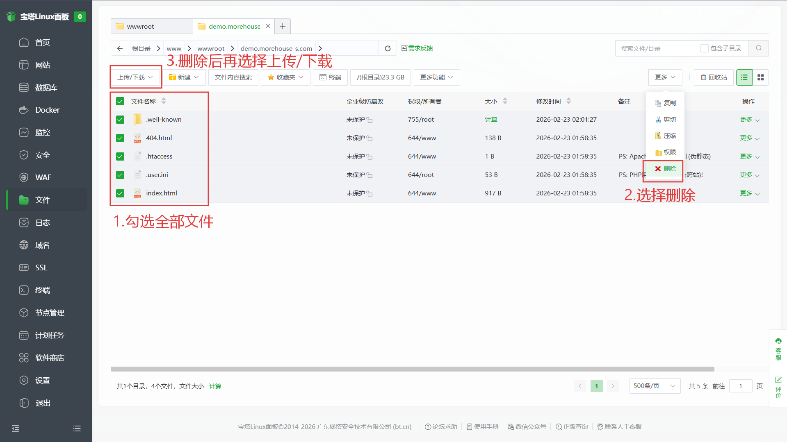
上传WordPress源代码
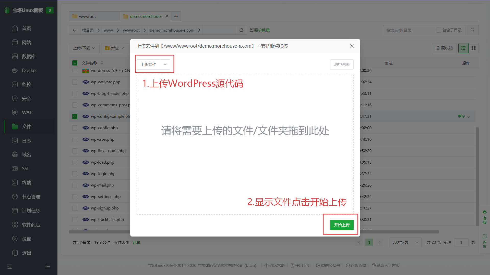
解压文件
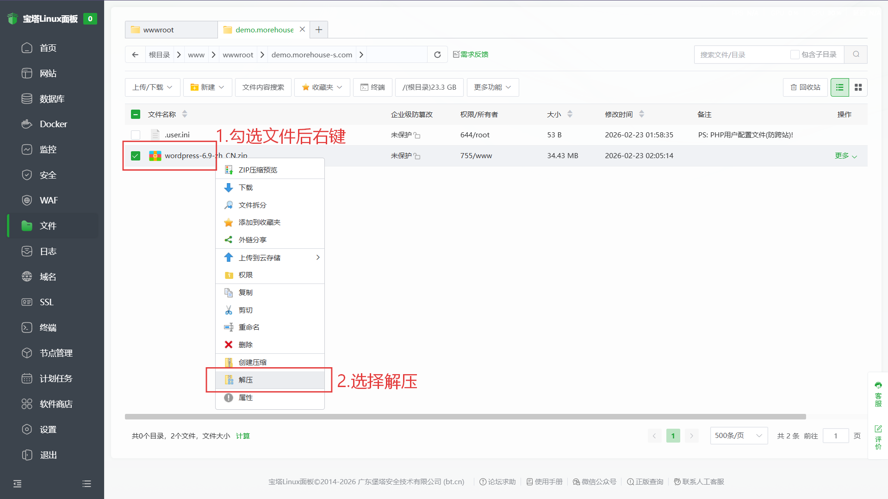
全部默认即可，直接解压
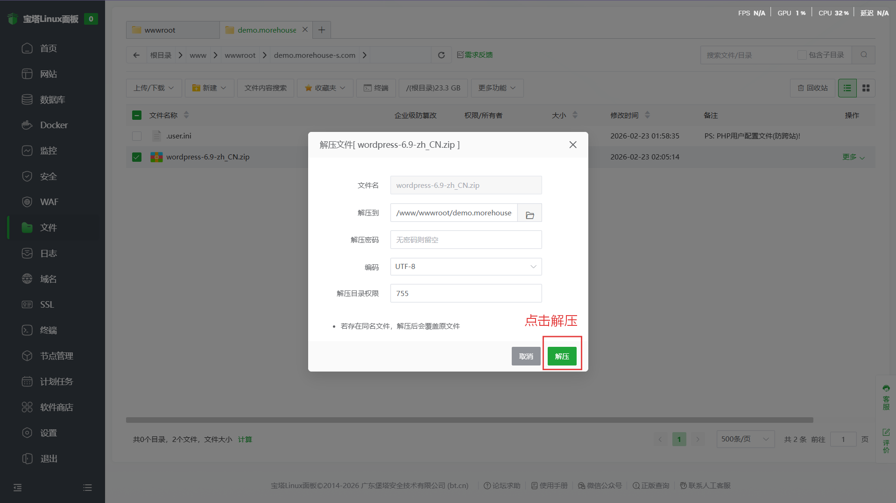
解压完成后双击进入文件夹
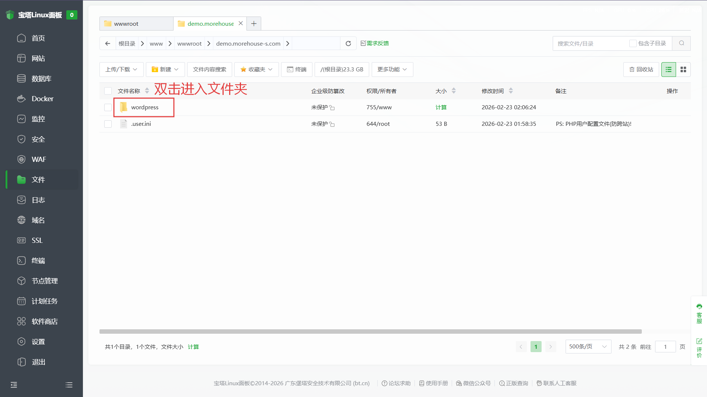
全选文件剪切。返回根目录。
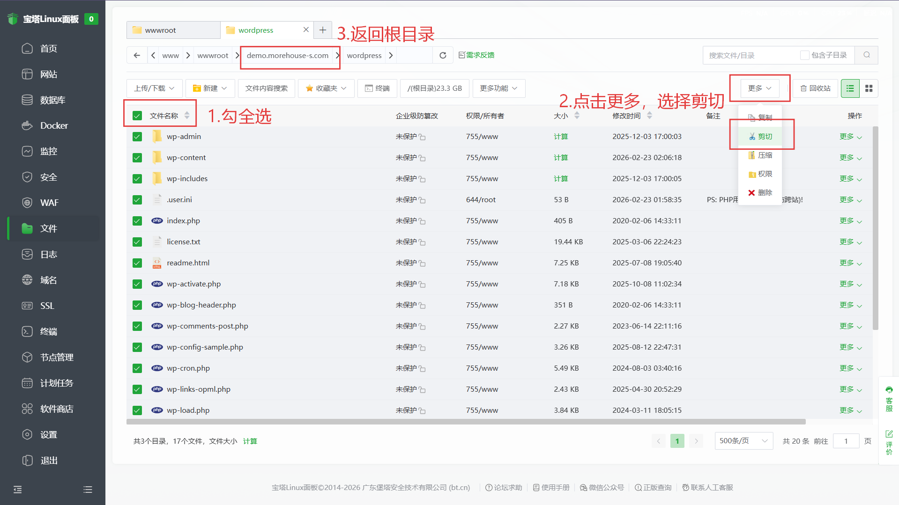
将文件粘贴在根目录下即可。

## 访问网站域名，进行下一步操作。

### 安装WordPress程序
当前页面下，点击“现在就开始！”按钮
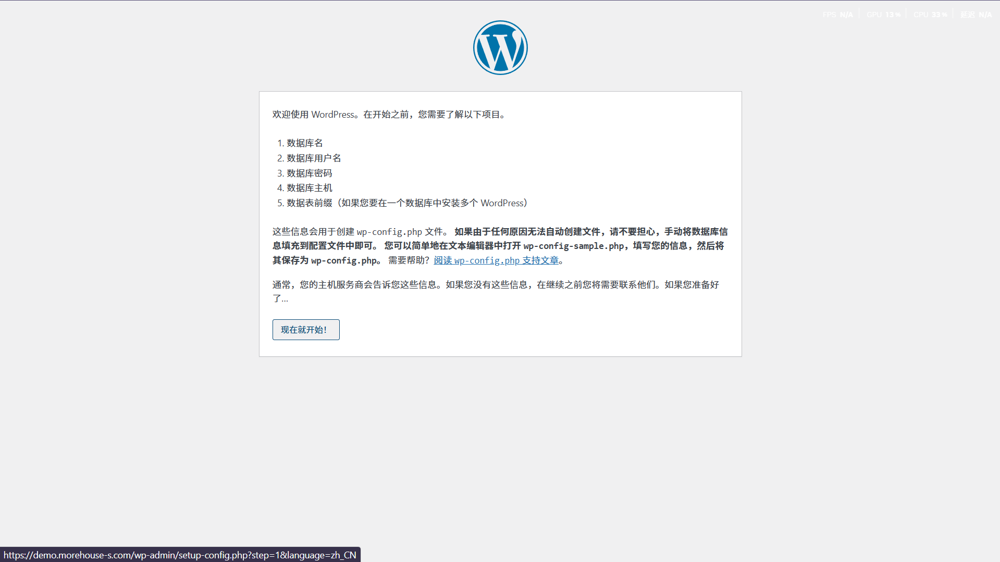
输入数据库名称密码进行安装必备库
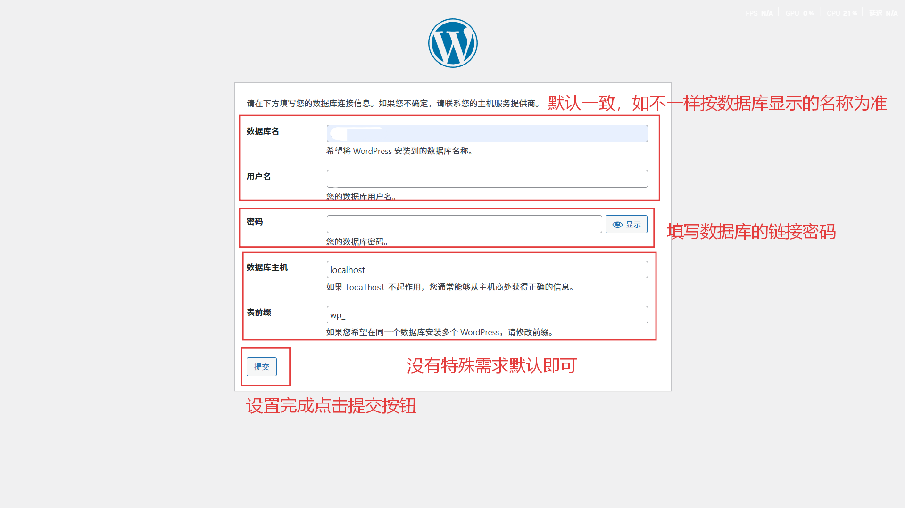
输入属于你自己的站点信息和管理员账号
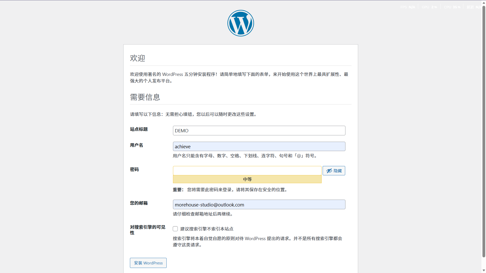
干得不错！来登录后台吧。
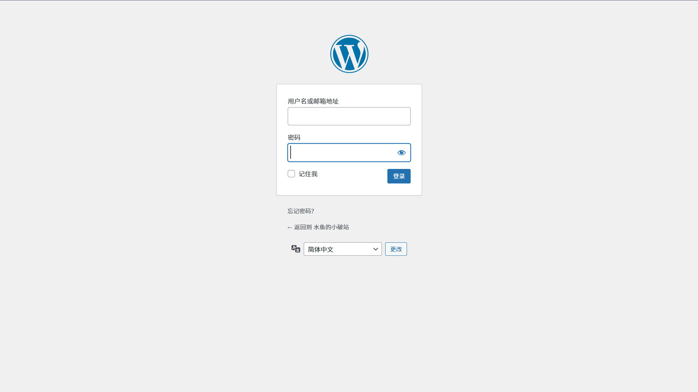

