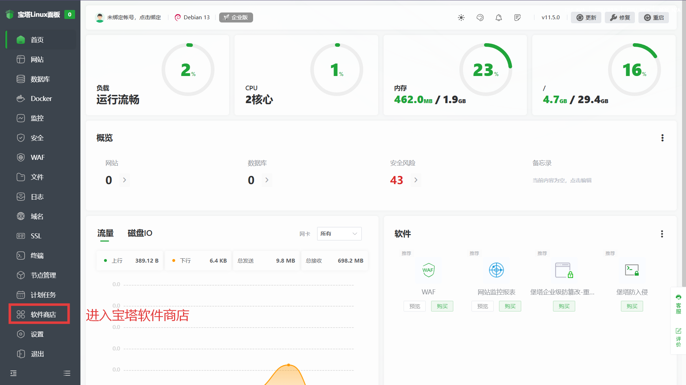
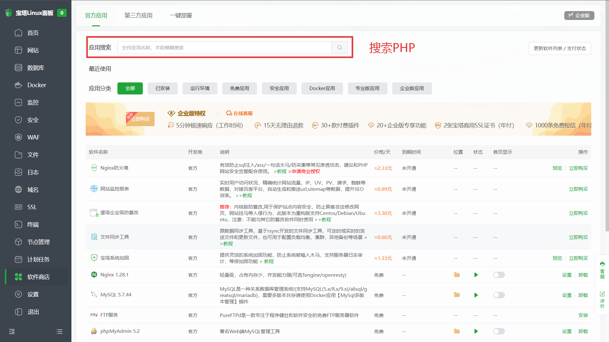
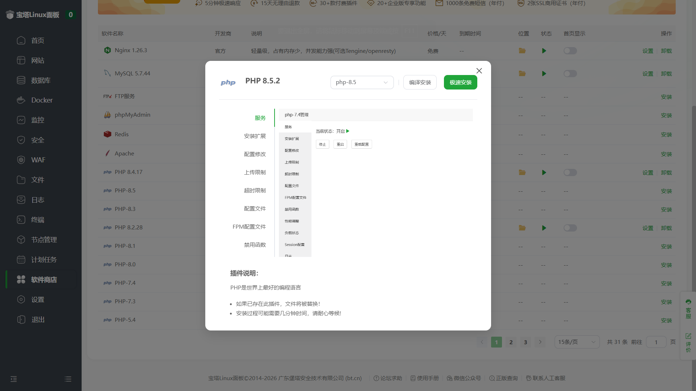
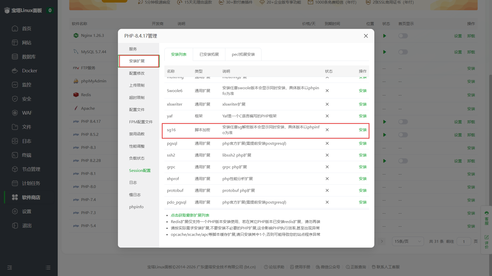
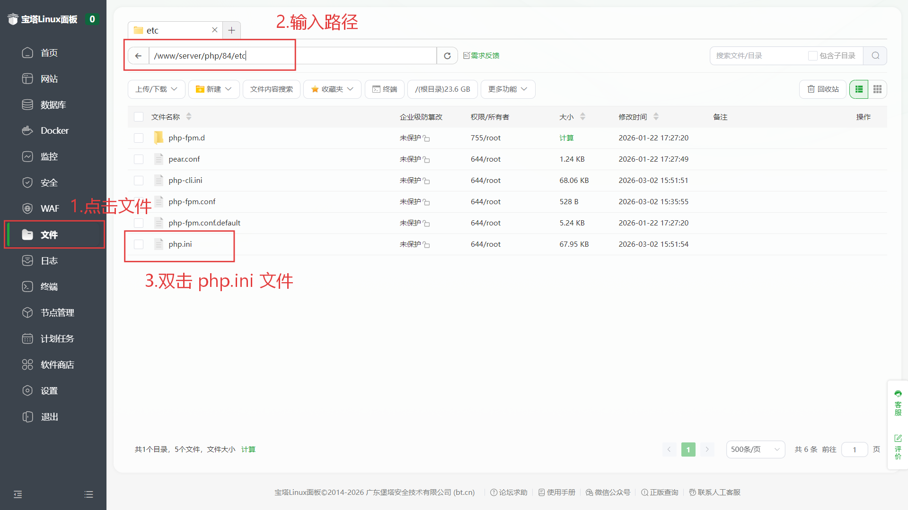
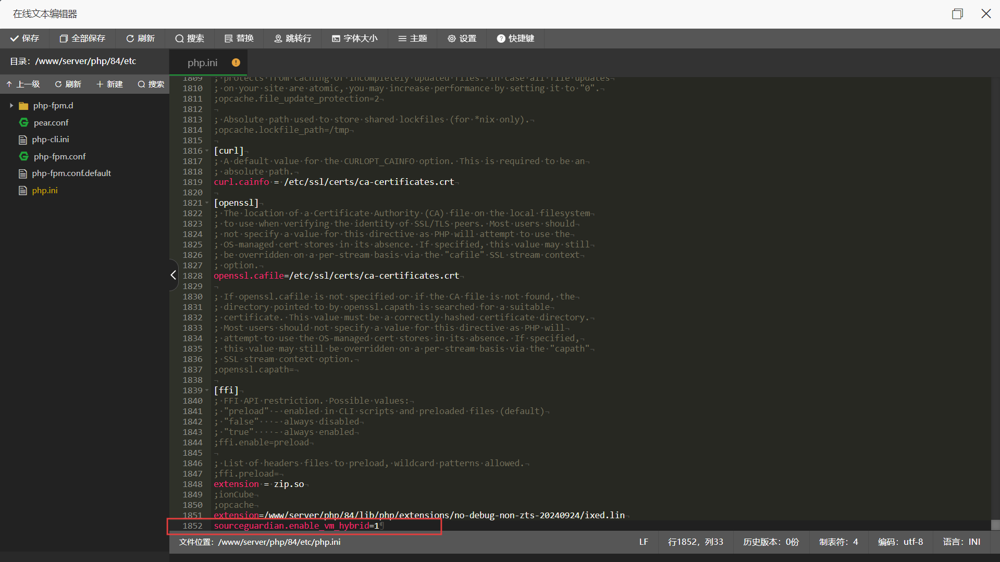
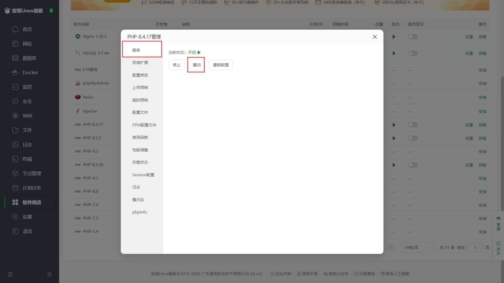

# 宝塔PHP环境配置
作者：[阿城](https://blog.morehouse-s.com/)

## PHP配置
本次以 PHP 8.4 版本为例。

点击进入软件商店

在搜索框中搜索 PHP。

PHP版本选择 PHP 8.4 版本，选择完成点击极速安装。

进入 已安装 分类，选择并进入PHP 8.4 设置

在PHP设置中点击安装扩展，选择并安装 sg16 扩展，耐心等待绿色字样的安装变成红色字样的卸载，即为安装成功。

1.点击侧边栏的 文件
2.在路径框输入路径： /www/server/php/84/etc 按回车。
3.找到 php.ini 文件，双击进入。

下滑到最后一行填写：sourceguardian.enable_vm_hybrid=1 并保存文件。

点击服务，点击重启。以重启PHP服务。

# 环境部分配置完成，请跳转至 添加站点 部分继续操作。

# 还不会安装或懒得安装的，联系QQ：108974129 代安装。8元/次。
